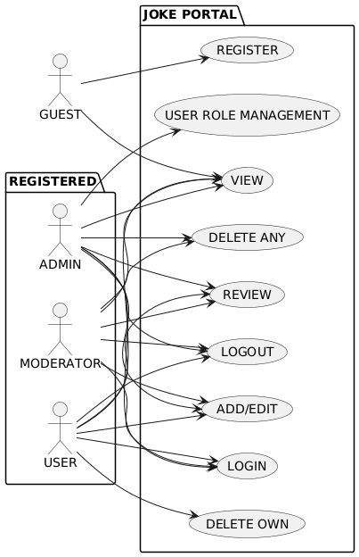
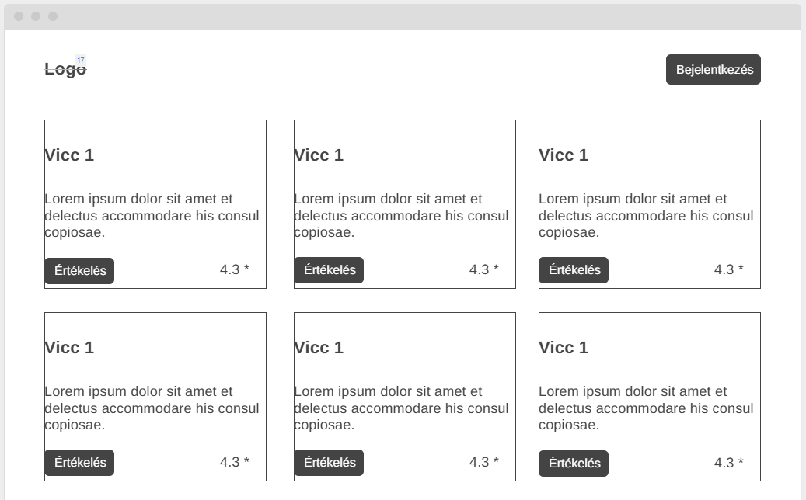
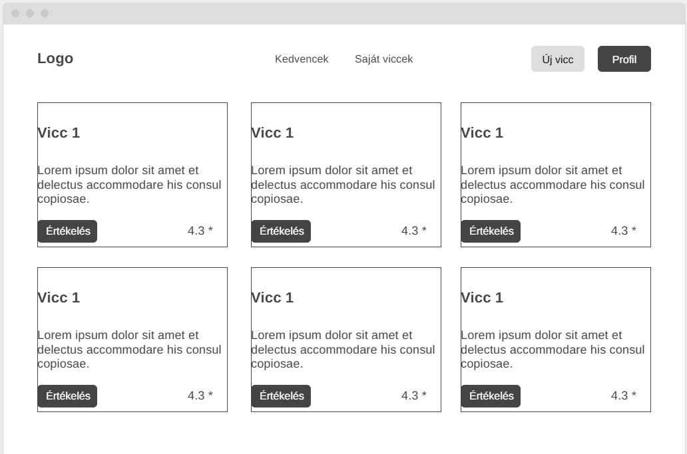
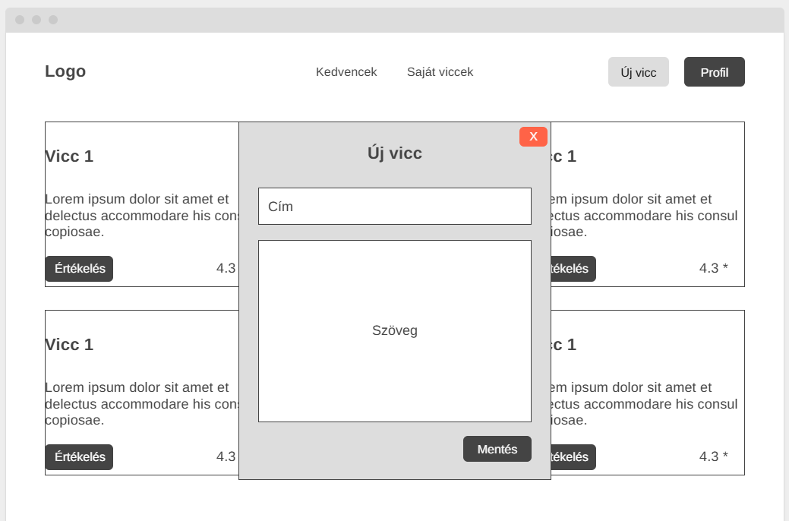
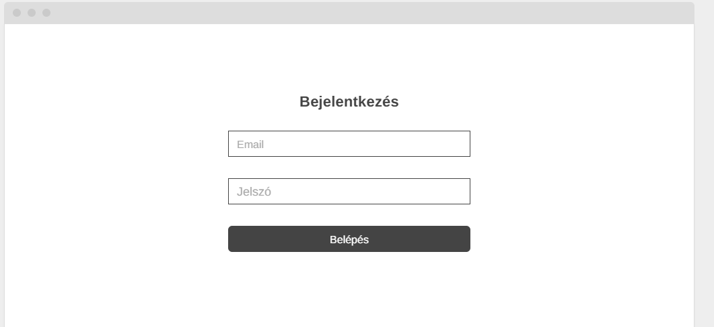
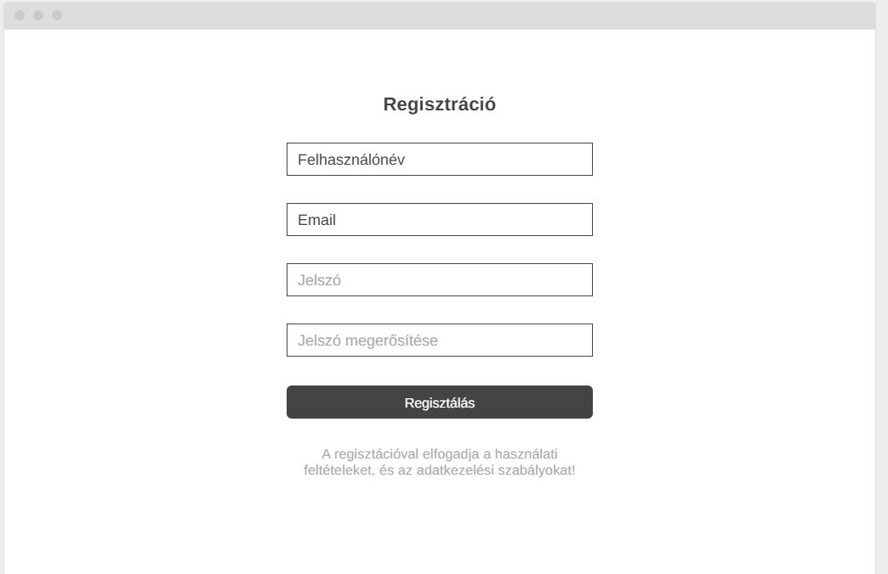
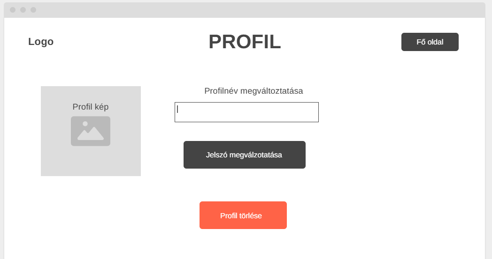

# Rendszerterv

1. __A rendszer célja__
   * A rendszer célja, hogy egy fárasztó nap után a felhasználók ki tudjanak kapcsolódni, jó vicceket olvasni és megosztani egymással. Ezeket a vicceket a többi felhasználó tudja értékelni.

2. __Projektterv__
   * Projekt munkások és felelősségek:
   * __Backend munkálatok__: Kiss Álmos, Majoros Máté
   * __Frontend munkálatok__: Zsibók Bence, Szabó Balázs
   * __Ütemterv__:

   |Funció/Story|Feladat/Task|Prioritás|Becslés|Aktuális becslés|Eltelt idő|Hátralévő idő|
   |-------------|-----------|---------|-------|----------------|----------|-------------|
   |Követelmény specifikáció||0|12|12|12|0|
   |Funkcionális specifikáció||0|12|12|12|0|
   |Rendszerterv||0|16|16|8|8|
   |Adattárolás|Adatmodell megtervezése|0|4|4|0|4|
   ||Adatbázis megvalósítása a backenden|1|1|1|0|1|
   |Frontend|Kezdőoldal elkészítése|1|6|6|0|6|
   ||Bejelentkezési oldal elkészítése|1|3|3|0|3|
   ||Regisztrációs oldal elkészítése|1|3|3|0|3|
   ||Új vicc irásához felület készítése|1|3|3|0|3|
   ||Kedvenc vicceket megjelenítő felület készítése|1|2|2|0|2|
   ||Saját vicceket megjelenítő felület készítése|1|2|2|0|2|
   |Backend|Bejelentkezés megvalósítása|1|5|5|0|5|
   ||Regisztráció megvalósítása|1|8|8|0|8|
   ||Vicc felvételének megvalósítása|1|4|4|0|4|
   ||Vicc szerkesztésének megvalósítása|1|3|3|0|3|
   ||Vicc törlésének megvalósítása|1|3|3|0|3|
   ||Vicc értékelésének megvalósítása|1|5|5|0|5|
   ||Vicc kedvelésének megvalósítása|1|1|1|0|1|
   ||Felhasználói jogok megvalósítása|1|4|4|0|4|

3. __Üzleti folyamatok modellje__
   

4. __Követelmények__
   * Funkcionális követelmények:
     * Felhasználó adatainak tárolása
     * Viccek tárolása
     * Viccek szerkesztése
     * Felhasználók módosítása
     * Felhasználók törlése
     * Felhasználó regisztrálása
     * Felhasználói szerepek módosítása
   * Nem funkcionális követelmények:
     * A felhasználók nem juthatnak hozzá más felhasználók személyes adataihoz a nevükön kívül.
     * A felhasználók nem módosíthatják mások vicceit
     * A felhasználók nem törölhetik mások vicceit.
     * A felhasználók jelszavai hashelve tárolandók
     * Alap védekezés SQL-Injection ellen
     * Reszponzív felhasználói felület
   * Törvényi előírások, szabványok:
     * GDPR-nak való megfelelés

5. __Funkcionális terv__
    __Rendszerszereplők__:
   * Admin
   * Felhasználó
   * Moderátor
   * Vendég

    __Rendszerhasználati esetek és lefutásaik__:
   * Admin:
     * Beléphet bármilyen szereplőként teljes hozzáférése van a rendszerhez
     * Viccek törlésére van lehetőségük
     * Felhasználók törlésére van lehetőségük
     * Mindent tud mint egy mezei felhasználó
   * Moderátor:
     * A felhasználói szinten felül tudja menedzselni a vicceket
   * Felhasználó:
     * Vicceket tud létrehozni
     * Vicceket tud értékelni
     * Saját vicceket tud törölni
     * Saját vicceket tud módosítani
     * Vicceket meg tud jelölni kedvencként
   * Vendég:
     * Vicceket tud nézni
     * Vicceket tud értékelni

    __Menü-hierarchiák__:
    * Bejelentkezés
      * Bejelentkezés
      * Regisztráció
    * Főoldal
      * Bejelentkezés
      * Profil szerkesztése
      * Új vicc létrehozása
      * Saját viccek
      * Kedvencek

6. __Fizikai környezet__
   * Az alkalmazás web platformra készül.
   * Fejlesztői eszközök:
     * Visual studio code
     * PyCharm
     * React
     * Django
     * SQLite

7. __Felülettervek__
   * Nem regisztrált felhasználó számára látható főoldal
   
   * Regisztrált felhasználó számára látható főoldal
   
   * Új vicc felvétele
   
   * Bejelentkezési oldal
   
   * Regisztrációs oldal
   
   * Saját profil kezelése
   

8. __Architekturális terv__
   * Backend:
     * A backend egy python library nevezetesen a django keretrendszer által lesz megvalósítva. Az adatok tárolását egy, a django által alapból létrehozott SQLite adatbázisban fog megtörténni. A kliensekkel JSON objektumokkal kommunikál.
   * Frontend:
     * A frontend React keretrendszer használatával fogjuk megvalósítani.

9. __Implementációs terv__
   * A frontend React keretrendszer használatával fogjuk megvalósítani, amely főként javascript használatát jelent és az oldal stílusát css stíluslapok segítségével fogjuk megformázni. A Reactos frontend különböző komponenseit különböző fájlokba fogjuk implementálni, ezzel biztosítva az újrafelhasználhatóság és az elszeparáltságot. Ezzel igyekszünk figyelembe venni azt, hogy egy komponensnek, csak egy feladata legyen. Az oldal kommunikálni fog a django által biztosított REST API-jal.

10. __Tesztterv__

    * A tesztelések célja a rendszer és komponensei funkcionalitásának vizsgálata, ellenőrzése, a rendszer megfelelő működésének biztosítása.
    * Tesztelési módok:
      * Unit tesztelés:
        A metódusok megfelelő müködésének vizsgálata érdekében teszteket kell írni, amelyek tesztelik az elvárt működést.
      * Alfa teszt:
        A teszt elsődleges célja a rendszer funkcióinak és megjelenésének tesztelése külöböző böngészőkben, illetve mobilos böngészőkben. A teszt sikeres ha az oldal megjelenése és fő funkciói elfogadhatóak különböző böngészőkben. A tesztelést a fejlesztők végzik.
        Manuális tesztelés: Az oldal UI elemeit manuálisan is teszteljük.
    * Tesztelendő funkciók:
      * Backend:
        * Képesnek kell lennie csatlakozni az webes alkalmazáshoz.
        * Képesnek kell lennie az adatbázis adatait lekérdezni és módosítani.
        * Képesnek kell lennie több egyszerre létező frontend példány kiszolgálására.
        * Képesnek kell lennie minden a felület szerint elérhető funkció elvégzésére.
      * Frontend:
        * A felületnek reszponzívank kell lennie.
        * A képernyőnek a képernyő terveknek megfelelően kell kinéznie.
        * A képernyő különböző elemeinek el kell látniuk a tőlük elvárt funkcionalitást.
        * A bejelenkezési felületnek megfelelően kell müködnie.
        * A vicceknek olvashatónak kell lenniük.
        * A viccek kattintásra felugró elmeként (react modal) jelennek meg.
        * A regisztrációs felületnek elérhetónek kell lennie a bejelentkezési felületről.
        * A regisztrációs felületen a megfelelő adatok megadásával a felhasználó regisztrálhat az oldalra.
        * A regisztráció után a felhasználó be kell tudjon jelentkezni.
        * Amennyiben a megadott adatok nem megfelelőek a regisztráció nem történhet meg és erről a felhasználót tájékoztatni kell.
        * A felhasználó által beküldött viccnek az oldalon láthatóvá kell válnia.

11. __Telepítési terv__
   A webes felület eléréshez csak egy támogatott böngésző telepítése szükséges, külön szoftver telepítése nem szükséges. A szerverre a böngészőn keresztül csatlakoznak a kliensek.

12. __Karbantartási terv__
   A weboldal üzemelése során szükséges annak karbantartása. Alkalmazkodni kell a felhasználók változó igényeihez, esetlegesen új funkciók hozzáadásával fenn tartani az felhasználók érdeklődését, illetve az oldal relevanciáját.

    * __Karbantartás__
      * Corrective Maintenance: A felhasználók által felfedezett és bejelentett hibák kijavítása.
      * Adaptive Maintenance: A program naprakészen tartása és finomhangolása.
      * Perfective Maintenance: A szoftver hosszútávú használata érdekében végzett módosítások, új funkciók, a szoftver teljesítményének és megbízhatóságának fejlesztése.
      * Preventive Maintenance: Olyan problémák feltárása és javítása, amelyek később gondot okozhatnak
